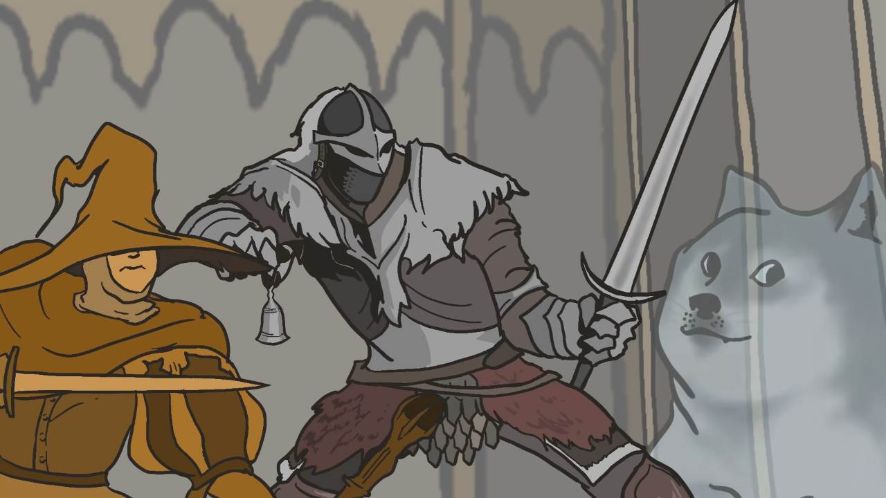

# ANIMATIONS

GP :rocket: https://blackseliger.github.io/Popovers/ :rocket:

**Important!**

Для корректного билда следуйте версиям ниже

* nodejs >=16.13.1
* npm >= 7.10.0

## Preview

## Tech stack

*  Javascript
*  HTML
*  CSS

## To start project in development mode:

* `npm install` - установит необходимые зависимости
* `npm run develop` - запустит "WebpackDevServer"

**Note:** Версии требуемые проектом указаны в `package.json` в поле `engines`

## To build project:

`npm run build` - "соберет" проект в "production" режиме.
